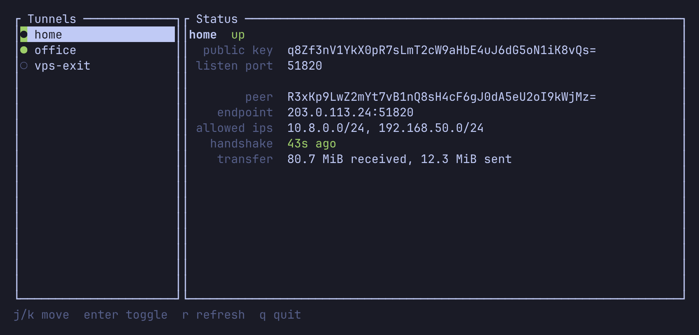

# tunl-tui

A minimal TUI for bringing `wg-quick` tunnels up/down and viewing their status.



## Setup

```sh
cargo build --release     # as your user, not root
sudo ./install.sh         # installs tunl-tui + helper, creates `elsec-tunl` group and sudoers rule
newgrp elsec-tunl         # or log out/in
tunl-tui
```

`install.sh` installs `/usr/local/bin/tunl-tui`, `/usr/local/bin/tunl-helper` and `/etc/sudoers.d/tunl-tui`, which lets
members of the `elsec-tunl` group run only that helper as root without a password. The helper
only accepts tunnel names that exist in `/etc/wireguard` and strips private/preshared keys from
status output.

## Uninstalling

```sh
sudo ./uninstall.sh
```

Removes the binary, helper, sudoers rule and `elsec-tunl` group. Tunnels that are up stay up.

## Running without installing

Set `TUNL_HELPER` to use the helper from the repo, running as root:

```sh
sudo TUNL_HELPER=./helper/tunl-helper ./target/release/tunl-tui
```

## Keys

`j`/`k` or arrows move · `enter`/`space` toggle up/down · `r` refresh · `q`/`esc` quit
